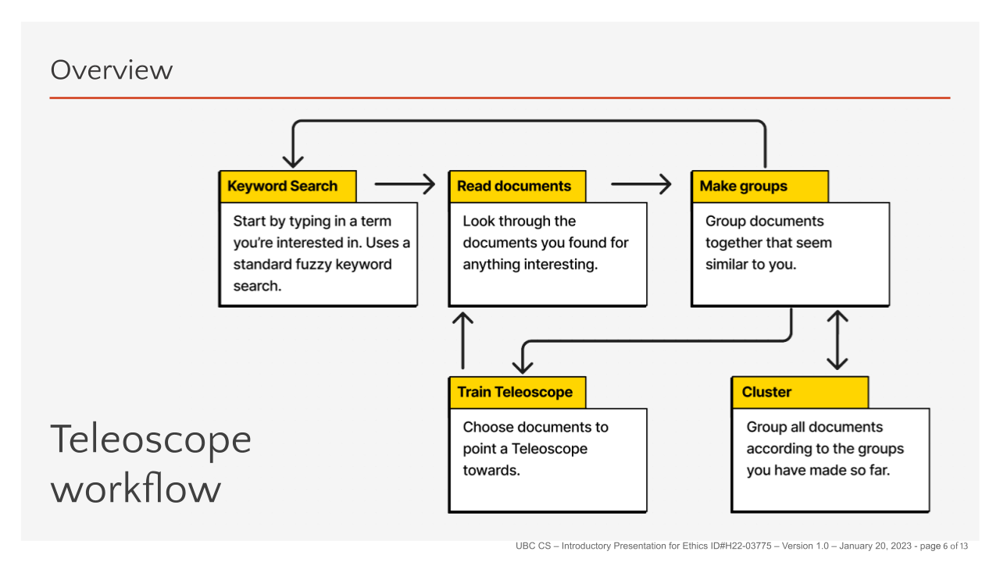

# README

Telescope is a system for supporting qualitative research with machine learning algorithms. It addresses the problem of having to look through a large corpora of documents (i.e., in the hundreds of thousands) for themes. It works by representing each document as a high-dimensional vector using Google’s Universal Sentence Encoder (USE). Users can interact with documents using a web-based interface by grouping the documents together. When the users group documents, the machine learning system moves a search vector closer to the documents they are adding to the group. The results are displayed to users as a list of documents that are closest to the example documents they have selected to group together.

The problem that Teleoscope addresses is that keyword searches are based on textual similarities between words. However, we want semantic similarities to be the basis of our searches. The above figure (which is an annotated screenshot of the interface) depicts a conceptual similarity between WiFi and Netflix in that they are both types of accounts that people often share among family and friends. A keyword search could not capture the similarity between those concepts. But our Teleoscope system can by using the USE document embeddings.

To develop themes, users start with a keyword search, but then start to search by example. The above figure depicts two documents that were found when searching for “endometriosis” as a keyword. However, if the user was attempting to develop a theme based on personal relationships rather than workplace conflicts, they could move the Teleoscope search vector closer to the left document by adding it to a group and selecting it.

As shown in the above figure, that will give a set of results that are more semantically similar to the selected document, which, in this case, shows documents that are about endometriosis AND relationships, but without having to explicitly search for those two terms as keywords.

The workflow for developing themes is as shown in the above figure. The user iteratively searches for keywords, reads the relevant documents, groups them together and selects the documents to train the Teleoscope system with, then repeats. There is also an experimental clustering feature that allows you to use the system to create groups automatically based on the groups you have given it so far.

## Installation
Installation right now is oriented toward VM deployment, but if you want a local install, you can create an Ansible inventory which lists `localhost` as the target deployment.

For general development, it's recommended to go through the full Ansible install locally.

For frontend-only development, you can run `npm i` in `frontend` and then `npm run dev` to run the webpack development server on `localhost:3000`.

