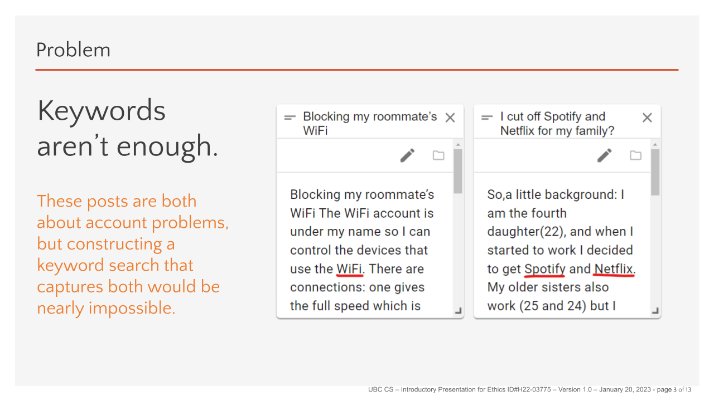
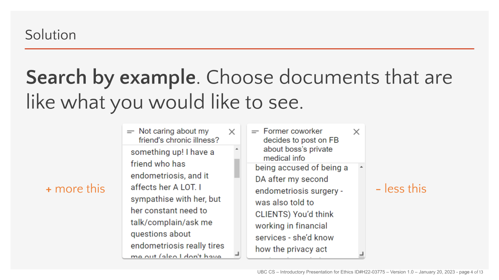
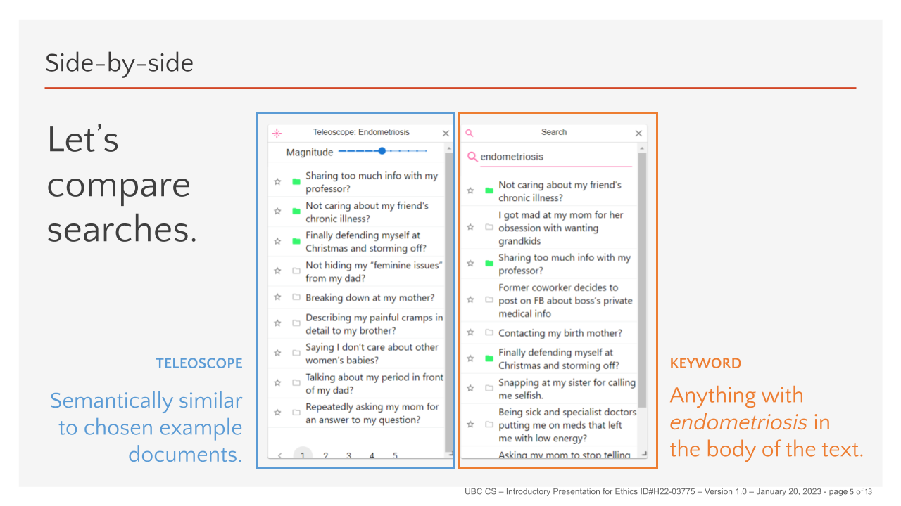

# Teleoscope Overview

Telescope is a system for supporting qualitative research with machine learning algorithms. It addresses the problem of having to look through a large corpora of documents (i.e., in the hundreds of thousands) for themes. It works by representing each document as a high-dimensional vector using Google’s Universal Sentence Encoder (USE). Users can interact with documents using a web-based interface by grouping the documents together. When the users group documents, the machine learning system moves a search vector closer to the documents they are adding to the group. The results are displayed to users as a list of documents that are closest to the example documents they have selected to group together.



The problem that Teleoscope addresses is that keyword searches are based on textual similarities between words. However, we want semantic similarities to be the basis of our searches. The above figure (which is an annotated screenshot of the interface) depicts a conceptual similarity between WiFi and Netflix in that they are both types of accounts that people often share among family and friends. A keyword search could not capture the similarity between those concepts. But our Teleoscope system can by using the USE document embeddings.



To develop themes, users start with a keyword search, but then start to search by example. The above figure depicts two documents that were found when searching for “endometriosis” as a keyword. However, if the user was attempting to develop a theme based on personal relationships rather than workplace conflicts, they could move the Teleoscope search vector closer to the left document by adding it to a group and selecting it.



As shown in the above figure, that will give a set of results that are more semantically similar to the selected document, which, in this case, shows documents that are about endometriosis AND relationships, but without having to explicitly search for those two terms as keywords.


The workflow for developing themes is as shown in the above figure. The user iteratively searches for keywords, reads the relevant documents, groups them together and selects the documents to train the Teleoscope system with, then repeats. There is also an experimental clustering feature that allows you to use the system to create groups automatically based on the groups you have given it so far.

## Installation
Installation right now is oriented toward VM deployment, but if you want a local install, you can create an Ansible inventory which lists `localhost` as the target deployment.

For general development, it's recommended to go through the full Ansible install locally.

For frontend-only development, you can run `npm i` in `frontend` and then `npm run dev` to run the webpack development server on `localhost:3000`.

# Technical notes
Teleoscope is designed from the ground-up to make use of distributed and cloud-based computing. This means that there is a steep learning curve for people who would like to become involved in the prokect. If you are just getting started, here are some of the technologies that you will need to learn:

## Frontend: React, NextJS, and MUI
The frontend is built using [React](https://reactjs.org/) via the [NextJS](https://nextjs.org/) framework. Most components are customizations of [MUI](https://mui.com/) components. Our interaction and windowing system is based on [React Grid Layout](https://github.com/react-grid-layout/react-grid-layout).

If you'd like to get started developing for the Teleoscope frontend, create a starter project (e.g., [by following the NextJS tutorials](https://nextjs.org/learn/foundations/about-nextjs)) and add in MUI components. Next, try a [Redux](https://redux.js.org/) tutorial to see how to manage local frontend state.

## Backend: MongoDB, RabbitMQ, and Celery
The technologies that allow us to create a distributed processing system are [RabbitMQ](https://www.rabbitmq.com/) and [Celery](https://docs.celeryq.dev/en/stable/index.html). After installing, work through the examples in the [Celery starter guide](https://docs.celeryq.dev/en/stable/getting-started/introduction.html).

Our database is [MongoDB](https://www.mongodb.com/). After installing MongoDB, you can install [MonogoDB Compass](https://www.mongodb.com/products/compass) as a graphical user interface for searching through the database.

## Machine Learning: USE, UMAP, and HDBSCAN
Our machine learning pipeline starts by encoding document text with [Universal Sentence Encoder](https://www.tensorflow.org/hub/tutorials/semantic_similarity_with_tf_hub_universal_encoder). This allows us to create similarity scores for words/sentences that may have low or no representation in user datasets. When users have created groups, we then perform dimensionality reduction with [UMAP](https://umap-learn.readthedocs.io/en/latest/supervised.html). 

You can think of it like this: when the user creates a group, they are saying that they believe that the documents are similar, whether or not the USE model would consider them to be very close. Rather than recalculating a whole new model, we simply decide to reduce dimensions with a custom distance metric that says "documents in the same group should end up close when dimensions are cut." The space is then transformed without having to retrain a neural network, which could take a very long time. Then, we perform clustering using [HDBSCAN](https://hdbscan.readthedocs.io/en/latest/how_hdbscan_works.html) and present the machine-created clusters to users. If they like the clusters, they can add them as groups and re-run the clustering.

## Cloud-first design
Teleoscope is easily deployable to new VMs using the [Ansible](https://www.ansible.com/) framework. You'll need your own AWS or Azure account and VMs to run public instances of Teleoscope, but you can create a test environment by creating an [vars/inventory.yaml](https://docs.ansible.com/ansible/latest/inventory_guide/index.html) that includes, say, `localhost` for your own machine, or any other host you may have access to. You'll need to create a [vars/vars.yaml](https://docs.ansible.com/ansible/latest/playbook_guide/playbooks_variables.html) file to house the following variables. You can just copy-paste the following and replace defaults with your own values:

```
remote_prefix: /home                              # example for linux 
conda_environment: teleoscope                     # any label will do
conda_prefix: /usr/share/miniconda3               # you can change this to ~/miniconda3 if you don't have access to /usr/share
mongodb_admin_name: example_admin                 # replace "example_admin" with your administrator name
mongodb_admin_password: admin_password            # replace "admin_password" with your administrator's password
mongodb_dev_name: example_dev                     # replace "example_dev" with your name
mongodb_dev_password: dev_password                # replace "dev_password" with your password
mongodb_database: teleoscope                      # any label will do
rabbitmq_vhost: teleoscope                        # any label will do
rabbitmq_admin_username: example_admin            # replace "example_admin" with your administrator name (can be different than above)
rabbitmq_admin_password: admin_password           # replace "admin_password" with your administrator's password (can be different than above)
rabbitmq_dev_username:  example_dev               # replace "example_dev" with your name (can be different than above)
rabbitmq_dev_password: dev_password               # replace "dev_password" with your password (can be different than above)
nodejs_version: 19                                # tested for 19
ubuntu_version: jammy                             # tested for focal and jammy, may need to change some configs for focal
```
